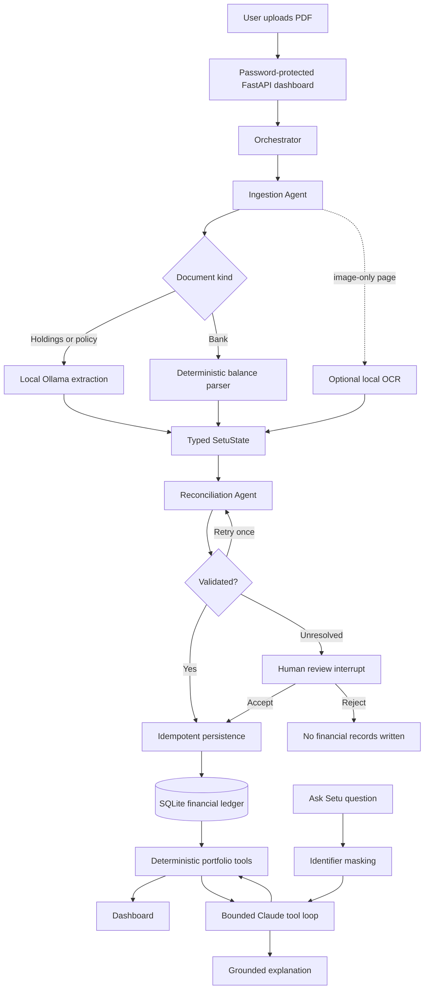

# Setu Final Architecture

Setu is a local-first cross-border wealth and portfolio agent for an individual with financial
assets in the United States and India. It turns heterogeneous brokerage, retirement, mutual-fund,
bank, and insurance documents into one source-backed view of net worth, investment performance,
allocation, currency exposure, obligations, and portfolio risk.

The governing principle is:

> Models interpret; deterministic code verifies and calculates; humans resolve uncertainty.

This document describes the implemented capstone system and separates current behavior from future
extensions.

## Scope

Setu currently supports:

- Text-based and scanned PDF ingestion through local extraction.
- Investment holdings with optional source-stated cost basis.
- Bank balances.
- LIC, endowment, ULIP, and term-insurance documents.
- USD/INR normalization using a configured deterministic FX table.
- Reconciliation, duplicate detection, source provenance, and human review.
- Net worth, allocation, source-backed ROI, concentration, currency exposure, liquidity, and an
  explainable portfolio-health diagnostic.
- Optional Claude Q&A over approved, sanitized calculation tools.

Setu does not trade, move money, submit forms, predict markets, calculate personalized tax advice,
or infer unsupported insurance values. Detailed expense tracking, live brokerage APIs, stock
research, and autonomous form filling are outside the final capstone scope.

## Runtime architecture



There are two related but separate agentic paths.

### 1. Document ingestion

LangGraph runs an explicit state machine:

```text
START -> ingest -> reconcile -> persist -> END
                         |          ^
                         +-> retry -+
                         +-> human review -> accept/reject
```

The graph is intentionally constrained. The Orchestrator does not invent arbitrary plans or tools.
It invokes known nodes, observes structured status, follows conditional edges, and preserves state
through a SQLite checkpointer.

### 2. Portfolio Q&A

Claude receives three approved tool schemas:

- `fx_convert`
- `compute_net_worth`
- `analyze_portfolio`

Claude chooses which tool to call, Python executes it, and Claude explains the returned JSON. The
loop is limited to four tool rounds and 1,200 output tokens by default. Claude cannot read a PDF,
query a filesystem path, or write to the ledger through this registry.

## Implemented roles

| Role | Implementation | Responsibility |
|---|---|---|
| Coordinator | `setu/agents/orchestrator.py` and `setu/graph/build.py` | Starts and resumes graph runs and shapes their outcomes |
| Ingestion Agent | `setu/agents/ingestion_agent.py` | Extracts local document text, classifies document type, invokes local structured extraction when needed, and returns typed records |
| Reconciliation Agent | `setu/agents/reconciliation_agent.py` plus graph nodes | Independently selects an authoritative stated total, checks tolerance, and routes unresolved cases to review |
| Financial analysis layer | `setu/tools/calc.py` and `setu/tools/insights.py` | Computes exact values, ROI, allocation, risk signals, and health diagnostics |
| Explanation agent | `setu/llm/claude.py` | Selects approved portfolio tools and explains sanitized results |

These components do not hold free-form conversations with each other. They exchange typed graph
state or tool JSON. The Form Assistant and Research Agent shown as “planned” in the UI are future
work, not active capstone agents. Setu does not use CrewAI.

## Reasoning and coordination

The ingestion path uses graph-based coordination rather than open-ended delegation:

1. The Ingestion Agent turns a document into validated structured fields.
2. The Reconciliation Agent checks those fields independently.
3. LangGraph routes a valid result to persistence, retries one mismatch, or pauses for a human.
4. Persistence applies idempotency and evidence rules before changing the ledger.
5. Portfolio tools recompute views from active, latest source snapshots.

Reconciliation uses a bounded, Tree-of-Thought-inspired hypothesis step. It generates independent
candidates for the statement’s stated total, including an explicitly labelled total, a table total,
and a largest-figure fallback. Candidates are ranked by source authority independently of the
extracted sum. This avoids selecting a convenient subtotal merely because it matches a bad
extraction. It is not a multi-level LLM beam search; the deterministic version proved easier to
test and safer for financial validation.

The Claude path is ReAct-like tool use: model action, deterministic observation, and a bounded next
step. Tool failures return as observations, but the loop cannot exceed its configured budget.

## Memory and storage

Setu uses three forms of state:

1. **Working state:** `SetuState`, a typed object holding one ingestion run’s structured fields,
   warnings, trace, retry count, and decision state.
2. **Durable workflow memory:** a separate SQLite LangGraph checkpoint database keyed by
   `thread_id`. This allows a review to pause and resume without storing raw policy text.
3. **Long-term financial memory:** the SQLAlchemy/SQLite ledger containing institutions, accounts,
   statements, holdings, balances, policies, policy values, obligations, and risk profile.

The ledger and checkpointer have different jobs: the ledger is financial truth; the checkpointer is
in-progress workflow state.

### Retrieval decision

An early design considered a semantic vector store for policy rules, past runs, and user corrections.
The final MVP does not implement that RAG layer. The safety-critical policy rule set is small, so
TERM/endowment/ULIP semantics were moved into deterministic, versioned Python logic instead of
similarity search. Exact portfolio questions use SQL, where semantic retrieval would be less
reliable than keyed queries.

Future retrieval remains appropriate for public, non-numeric reference material such as official
product documents or user-authored notes. Retrieved text must never override a failed valuation or
financial constraint.

## Document and data flow

### Extraction

- `pdfplumber` is the embedded-text fast path.
- Optional local OCR is used only for pages with too little embedded text.
- Holdings and policy text are converted to Pydantic models by local Ollama extraction.
- Clearly labelled fields are also recovered deterministically and can fill or correct missing
  model fields.
- Bank closing balances use a dedicated deterministic parser.

Temporary dashboard uploads are limited to PDFs of at most 25 MB and are removed after processing.

### Reconciliation and persistence

- Holdings are summed with `Decimal` and compared with the authoritative statement total using a
  configurable 0.5% tolerance.
- A SHA-256 file hash prevents duplicate ingestion.
- Institution, account, and statement-period checks prevent repeated snapshots from inflating net
  worth.
- Only the latest active snapshot per account contributes to current portfolio calculations.
- Every persisted financial value retains its statement identifier and date.

### Source control

Each statement is a reversible data boundary. Deactivating a source does not delete its records;
it excludes all linked holdings, balances, policy values, policy contracts, obligations, and
transactions from current calculations. Reactivating it restores eligibility, subject to the
latest-snapshot rule.

## Insurance semantics

An insurance contract, its protection amount, and its current asset value are separate concepts.

| Policy type | Current net-worth treatment |
|---|---|
| Term | Coverage is displayed; asset value is zero/not applicable |
| Endowment or LIC savings policy | Included only when a current surrender value is explicitly stated |
| ULIP | Included only when a current fund value is explicitly stated |

Premiums, sum assured, projected maturity values, bonuses, and paid premiums do not become current
wealth. A missing surrender value is unknown rather than zero, and the policy can still be retained
as a valid contract with incomplete valuation evidence.

## Deterministic analytics

The language models do not calculate financial figures. Python and SQL compute:

- Base-currency net worth.
- Allocation by asset class, geography, and currency.
- Cost-basis coverage, unrealized gain/loss, and ROI.
- Concentration and target-allocation drift.
- Known premium obligations and cash coverage.
- A five-component portfolio-health diagnostic.

The health score awards 100 possible points: target alignment 25, concentration 20, currency 15,
liquidity 20, and data completeness 20. It is an explainable diagnostic, not a suitability rating,
market prediction, or instruction to trade.

## Safety boundaries

- Setu is read-and-advise only; it has no money-movement or trade tool.
- Raw documents stay on the local ingestion path.
- The cloud tool registry exposes calculated ledger summaries, not raw text or file paths.
- Likely identifiers typed into Ask Setu are masked before the request reaches Claude.
- The personal Anthropic key is read only from the project-local, gitignored `.env` and is pinned to
  the official Anthropic HTTPS origin.
- Typed schemas, Decimal arithmetic, reconciliation, and policy evidence checks gate persistence.
- Reconciliation mismatches and conflicting policy evidence require human review.
- Unknown currency, unusable extraction, or unsupported valuation fails closed.
- The local dashboard requires a password and binds only to `127.0.0.1`.
- Source activation is reversible and auditable.

## Course concepts mapped to the final implementation

| Concept | Final implementation |
|---|---|
| Tool calling | Claude selects from three deterministic portfolio tools |
| Reasoning loop | Bounded Claude tool loop plus observable graph action/observation traces |
| Memory | Typed working state, SQLite checkpointer, and relational long-term ledger |
| Retrieval | Proposed, then deliberately deferred; deterministic policy rules replaced unsafe semantic matching in the MVP |
| Further reasoning | Bounded multi-hypothesis reconciliation; not the originally planned LLM beam search |
| Multi-agent coordination | Explicit LangGraph handoffs among coordinator, ingestion, reconciliation, persistence, and human review |
| Guardrails | Local raw-data boundary, schema and evidence validation, deterministic math, source provenance, authentication, and HITL |

## Code map

```text
setu/
├── agents/
│   ├── orchestrator.py          # starts and resumes graph runs
│   ├── ingestion_agent.py       # local document interpretation
│   └── reconciliation_agent.py  # independent total hypotheses and tolerance check
├── graph/
│   ├── build.py                 # LangGraph nodes, edges, retry, interrupt
│   ├── nodes.py                 # ingestion, reconciliation, review, persistence
│   └── state.py                 # typed workflow state
├── models/                      # SQLAlchemy financial ledger
├── tools/
│   ├── pdf_extract.py           # embedded text and local OCR
│   ├── calc.py                  # source-aware exact portfolio calculations
│   ├── insights.py              # ROI, risk, health, and review signals
│   ├── fx.py                    # deterministic configured conversion
│   └── registry.py              # Claude-facing sanitized tool schemas
├── llm/
│   ├── local.py                 # Ollama client
│   └── claude.py                # bounded Anthropic tool loop
├── dashboard/                   # authenticated FastAPI UI and upload coordinator
├── synthetic/                   # reproducible synthetic corpus generator
├── demo.py                      # isolated source-linked demo ledger
└── evaluation.py                # repeatable safety/correctness evaluation
```

## Evaluation evidence

The current synthetic evaluation checks document classification, golden reconciliation, mismatch
escalation, exact net-worth calculation, cost-basis coverage, term-policy safety, three-horizon risk
coverage, cloud privacy boundaries, and optional live local-model extraction. The regression suite
contains 110 tests.

These results establish repeatability on the included synthetic corpus. They do not establish broad
accuracy across every institution or document layout.

## Current limitations

- The evaluation corpus is small and synthetic.
- FX rates are configured snapshots rather than a live, dated market feed.
- OCR is an optional local dependency and increases setup time.
- Local extraction quality varies with document layout and hardware/model choice.
- The health score is a transparent heuristic, not a regulated financial assessment.
- Setu has no complete liability, tax, goal, dependent, income-stability, or emergency-expense model.
- Semantic RAG, user-correction learning, parallel multi-document orchestration, research, and form
  filling are not implemented.
- The application is a single-user local development system, not an internet-facing production
  service.

## Realistic next steps

1. Expand the anonymized golden corpus across more institutions and document layouts.
2. Add dated FX and market-price tools with caching and source timestamps.
3. Add editable goals, liabilities, emergency-reserve inputs, and risk-profile controls.
4. Introduce retrieval only for cited public reference documents and user notes.
5. Add structured correction memory after enough real error patterns are observed.
6. Package Ollama/OCR setup behind a health-check and one-command launcher.
7. Build research and form-filling agents as separate, permission-scoped workflows.
