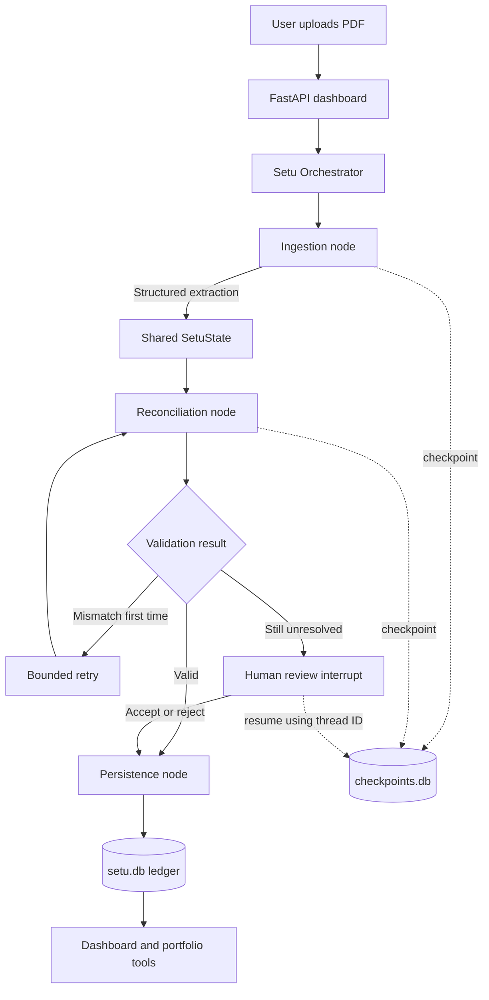
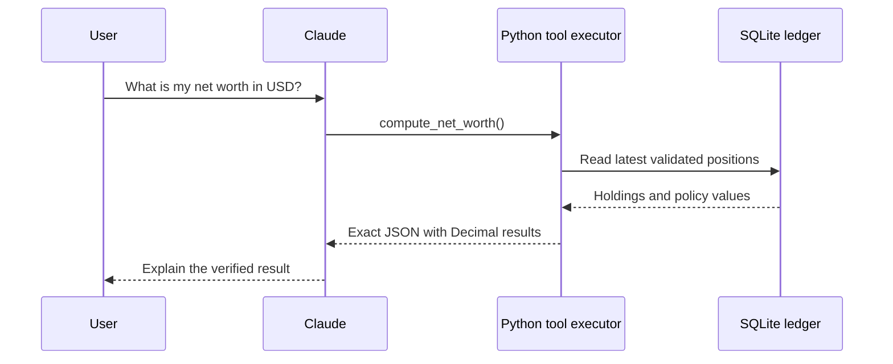

# Setu Architecture and Interview Guide

This guide explains how Setu is organized, how its agents communicate, what LangGraph, LangChain,
and CrewAI mean, and how to explain the project accurately in an interview.

## The main idea

Setu's agents do not chat with each other. They communicate by reading and updating a shared,
typed data object called `SetuState`. LangGraph controls which component runs next.

A useful analogy is a financial case file:

- `SetuState` is the case file.
- Each agent is a specialist who reads the file and adds structured findings.
- LangGraph is the workflow manager routing the file.
- `thread_id` is the case number.
- `checkpoints.db` is the saved work-in-progress file.
- `setu.db` is the final financial ledger.

## How Setu works



The workflow is defined in `setu/graph/build.py`, and the shared state is defined in
`setu/graph/state.py`.

## Example: uploading an LIC policy

1. The FastAPI dashboard accepts the PDF.
2. The Orchestrator starts a LangGraph run with a `thread_id`.
3. The Ingestion Agent:
   - Uses `pdfplumber` if the PDF contains text.
   - Uses OCR only when the PDF is scanned or contains too little usable text.
   - Detects that it is an insurance-policy document.
   - Sends extracted text to the local Ollama model.
   - Converts the model output into a validated `ExtractedPolicy` structure.
   - Masks policy and account identifiers.
   - Does not put raw policy text into the durable LangGraph checkpoint.
4. LangGraph merges the structured result into `SetuState` and invokes reconciliation.
5. The Reconciliation Agent applies deterministic insurance rules:
   - A term policy is protection, not a financial asset.
   - An endowment policy contributes to current net worth only when an explicit surrender value is
     available.
   - A ULIP contributes its explicitly stated current fund value.
   - Premium, coverage, bonuses, and projected maturity amounts are not treated as current value.
   - A missing current value remains unknown rather than becoming zero.
6. LangGraph routes the result:
   - Valid results go to persistence.
   - Unusable or conflicting results pause for human review.
   - Rejected results write nothing.
7. Persistence writes the structured policy, value evidence, and premium obligation to SQLite.
8. Uploading the same file again is detected through its SHA-256 hash and skipped.

A simplified handoff might look like this:

```python
{
    "document_kind": "POLICY",
    "institution": "Life Insurance Corporation of India",
    "extracted_policies": [
        {
            "policy_name": "LIC New Endowment Plan",
            "policy_type": "ENDOWMENT",
            "policy_number": "****1700",
            "sum_assured": "500000",
            "premium_amount": "24000",
            "surrender_value": None,
            "currency": "INR",
        }
    ],
    "file_hash": "...",
    "already_ingested": False,
}
```

## How the agents communicate

### 1. Structured state

Every node receives the current state and returns only the fields it wants to add or change.

```text
Ingestion Agent writes:
    extracted_policies
    document_kind
    file_hash
    institution

Reconciliation Agent reads those fields and writes:
    reconcile_status
    policy_warnings
    sum_extracted
    valuation_basis

Persistence reads the validated fields and writes:
    persisted_policies
    persisted_obligations
    persisted_skipped
```

The agents therefore exchange validated fields rather than uncertain natural-language claims.

### 2. Conditional routing

The Reconciliation Agent does not directly call persistence. It writes a status, and LangGraph
uses that status to select an edge:

```text
reconcile_status = ok        -> persist
reconcile_status = mismatch  -> retry or human review
```

This creates an explicit, testable control path.

### 3. Checkpoints and thread IDs

LangGraph saves the state after each node. If a run pauses for review, Setu can stop and later
resume it using the same `thread_id`. The thread ID identifies a saved workflow execution; it does
not represent another agent or chatbot.

## The separate Claude tool-calling path

Document ingestion and Claude question answering are related but separate workflows.



Claude receives tool descriptions and decides which approved tool to request. Python executes the
tool and returns JSON. Claude then explains the verified result.

The responsibility split is:

- Claude decides which tool is appropriate.
- Python queries the ledger and performs calculations.
- Monetary arithmetic uses `Decimal`.
- Claude explains the tool result.
- Claude is instructed not to calculate financial figures itself.

This is bounded agency: the model can choose among approved actions, but it cannot invent arbitrary
actions or directly write financial data.

## LangChain, LangGraph, and CrewAI

| Technology | What it is | Setu usage |
|---|---|---|
| LangChain | High-level framework for models, tools, retrieval, and prebuilt agent loops | Not directly installed |
| LangGraph | Runtime for stateful graphs, branching, checkpoints, and human review | Used for ingestion |
| CrewAI | Framework for role-based agent teams, tasks, delegation, crews, and flows | Not used |
| Ollama | Local model server | Runs Setu's extraction model |
| Claude | Cloud language model | Selects tools and explains portfolio results |
| FastAPI | Web and API framework | Serves the local dashboard and ingestion endpoints |
| SQLAlchemy/SQLite | Database layer | Stores financial records and workflow checkpoints |

### LangChain

LangChain is a broad framework for connecting language models to tools and application data. It
provides standard interfaces for model providers, tool calling, structured output, document
loading, embeddings, vector stores, retrieval, and agent loops.

The full `langchain` package is not currently installed in Setu. Setu uses the Ollama and Anthropic
SDKs directly. LangChain could later help with RAG, provider switching, standard tool wrappers,
middleware, and tracing.

Official reference: <https://docs.langchain.com/oss/python/langchain/overview>

### LangGraph

LangGraph is the lower-level workflow runtime from the same ecosystem. It provides:

- Nodes that perform work
- Edges that define allowed transitions
- Shared state
- Conditional branches
- Checkpoints
- Human-review interrupts
- Loops and retries

LangGraph can be used without LangChain, which is how Setu uses it. It is a better fit for Setu's
financial ingestion path because Setu needs explicit state, predictable transitions, durable human
review, and tight control over database writes.

Official reference: <https://docs.langchain.com/oss/python/langgraph/overview>

### CrewAI

CrewAI organizes systems as teams of agents with roles, goals, tools, tasks, and delegation. It is
well suited to open-ended workflows such as a researcher producing evidence, an analyst evaluating
it, a writer producing a report, and a reviewer critiquing it.

Setu does not use CrewAI. For the current financial workflow, free-form collaboration would add
model cost and make errors harder to trace. CrewAI might be considered for a future research
workflow, but adding it now would introduce a second orchestration framework without solving a
current requirement.

Official reference: <https://docs.crewai.com/core-concepts/Agents>

## Setu's architecture type

The best description is:

> A local-first, graph-orchestrated, hybrid deterministic and agentic architecture with human
> review.

The AI components handle tasks that require language interpretation:

- Understanding varying document layouts
- Mapping labels to a common financial schema
- Selecting appropriate Q&A tools
- Explaining results in plain language

Deterministic Python handles tasks that must be exact:

- Financial calculations
- FX conversion
- Reconciliation
- Policy valuation rules
- Database writes
- Duplicate detection
- Validation and routing

The main design principle is:

> Models interpret; code verifies and calculates; humans resolve uncertainty.

## What counts as an agent today

Setu does not yet contain five autonomous LLM agents chatting with one another.

1. **Orchestrator:** Runs the compiled graph. Current routing is mainly predefined and
   deterministic; it is not an LLM inventing a new plan for every document.
2. **Ingestion Agent:** AI-assisted document parsing and extraction using PDF tools, Ollama, schema
   validation, and deterministic label recovery.
3. **Reconciliation Agent:** A specialized deterministic component that independently checks
   extraction results.
4. **Financial tools:** Deterministic functions for net worth, allocation, and FX conversion.
5. **Claude Q&A agent:** A model-driven loop that chooses approved tools and explains their output.

The Form Assistant and Research Agent shown in the UI and design documents are planned, not fully
implemented. `SUBMISSION_checkpoint5.md` describes the target five-agent architecture.

## User-controlled data sources

Each imported `Statement` is a reversible data-source boundary. The dashboard shows whether the
source is active and whether it currently influences the portfolio. Deactivating it does not delete
the source or its records. Calculations and portfolio views exclude holdings, balances, policies,
premium obligations, and transactions linked to that statement until it is reactivated. If the
disabled source was the newest account snapshot, the previous active snapshot can become current.

This makes provenance operational: the user can see not only where a number came from, but also
decide which evidence Setu is allowed to use.

## Explaining the first resume bullet

> Built a local-first LangGraph workflow for US and India financial documents, combining
> Ollama-based structured extraction, deterministic reconciliation, checkpointed human review,
> and idempotent persistence behind FastAPI.

- **Local-first:** PDF parsing, Ollama extraction, SQLite storage, and the dashboard run locally.
  Claude is a separate, optional cloud Q&A path.
- **LangGraph workflow:** A stateful graph controls ingestion, reconciliation, review, and
  persistence.
- **US and India documents:** The normalized model handles multiple currencies, geographies,
  brokerage holdings, and Indian insurance products.
- **Ollama-based structured extraction:** A local model converts unstructured PDF text into
  validated Pydantic fields.
- **Deterministic reconciliation:** Python checks totals and applies explicit policy rules.
- **Checkpointed human review:** Unresolved runs pause, save their state, and resume using a thread
  ID.
- **Idempotent persistence:** A file hash prevents duplicate records from the same document.
- **Behind FastAPI:** The local dashboard and APIs expose the workflow.

## Explaining the second resume bullet

> Implemented Claude tool calling over Decimal-based FX and portfolio tools, with safeguards that
> mask identifiers, omit raw policy text from checkpoints, and exclude unsupported valuations.

- Claude receives a list of approved tools.
- Claude requests a tool rather than calculating the answer itself.
- Python executes the tool using exact `Decimal` arithmetic.
- Tool results return to Claude as structured JSON.
- Claude turns the verified result into an understandable answer.
- Account and policy identifiers in structured records are masked.
- Raw policy text is excluded from durable graph checkpoints.
- Missing surrender or fund values remain unknown.
- Term-insurance coverage is not counted as wealth.
- Unsupported or unverified values are excluded from net worth.

### Important privacy wording

Do not claim that Setu can remove every possible piece of personal information from a question a
user types manually. The implemented boundary is narrower and testable:

> The ingestion pipeline remains local, structured records mask identifiers, raw policy text is
> omitted from checkpoints, likely long identifiers in typed questions are masked, and Claude can
> access only sanitized ledger-calculation tools—not raw PDF text or filesystem paths.

## Thirty-second interview answer

> Setu is a local-first wealth data agent for people with financial assets in the US and India. I
> use LangGraph to coordinate a stateful ingestion workflow: a local Ollama-based agent extracts
> structured data from PDFs, a deterministic reconciliation component checks it, uncertain cases
> pause for human review, and validated records are written idempotently to SQLite. Separately,
> Claude can answer portfolio questions by selecting approved Python tools, but all financial
> calculations use Decimal-based deterministic code. The core design principle is that models
> interpret documents, while code verifies and computes financial values.

## Likely follow-up: Why not use one Claude prompt?

> A single prompt could extract and calculate, but it would combine probabilistic interpretation
> with financial truth. That would make errors difficult to locate and could let hallucinated
> values reach storage. Setu separates document interpretation, validation, calculation,
> persistence, and explanation. Each boundary has structured inputs and outputs, so failures can be
> tested independently and uncertain data can require human review before reaching the ledger.

## Accurate one-line summary

Setu is not a group of chatbots. It is a controlled workflow of specialized components exchanging a
structured financial case file.
